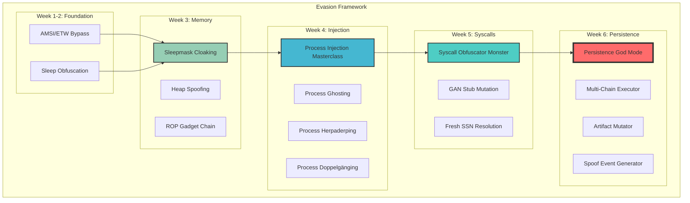
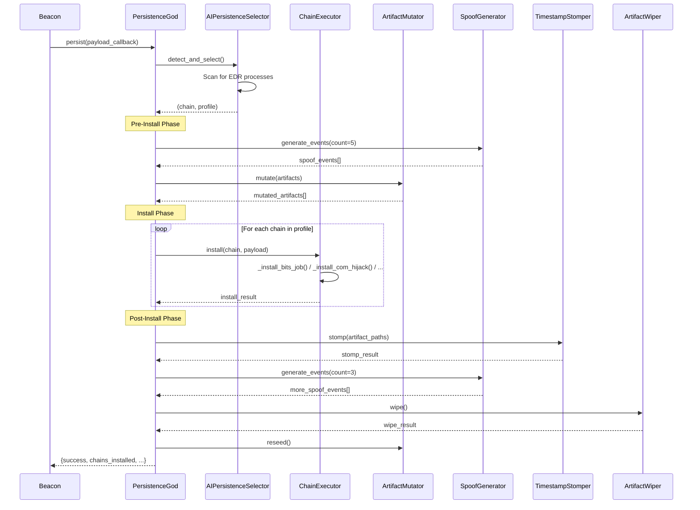
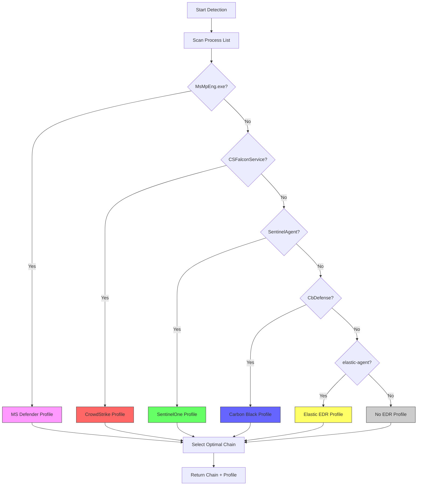
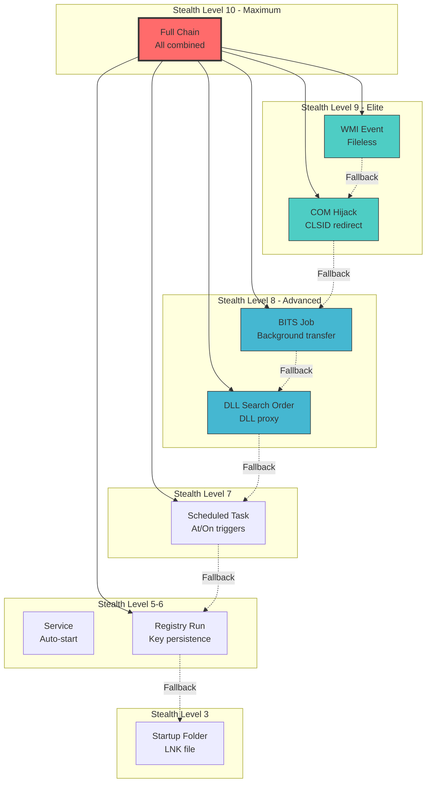
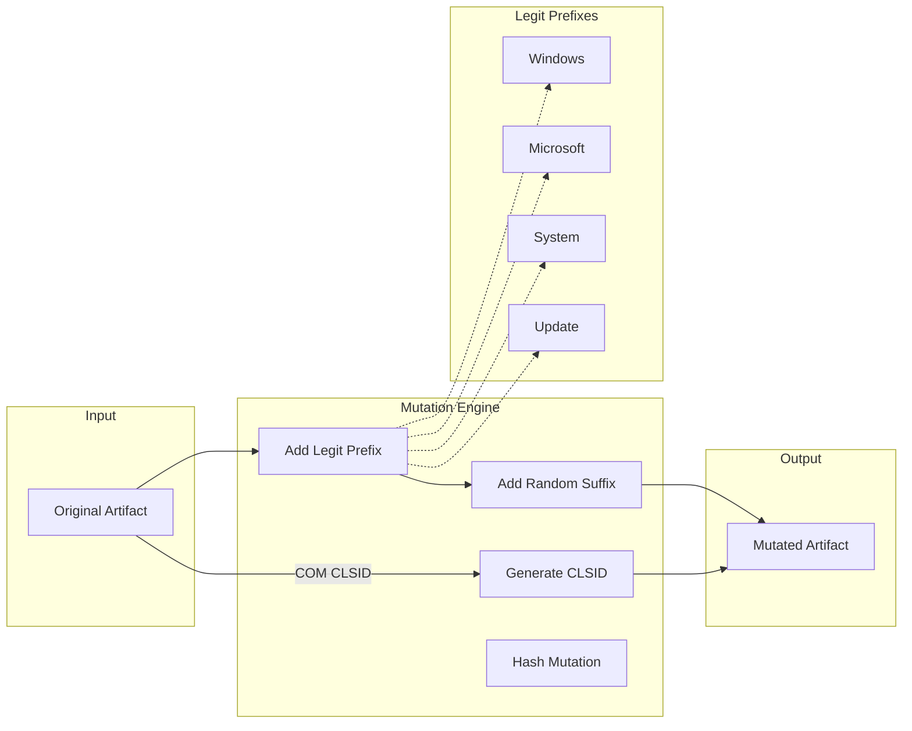
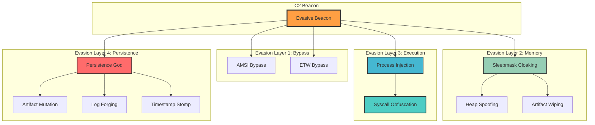

# Evasion Framework Documentation

> Ultimate EDR Evasion Framework with AI-Dynamic Adaptation

## Overview

The evasion framework provides a comprehensive suite of modules for bypassing modern endpoint detection and response (EDR) solutions. Each module is designed to work standalone or as part of an integrated beacon.

## Module Architecture



## Persistence God Mode Flow



## EDR Detection Flow



## Persistence Chain Hierarchy



## Artifact Mutation Process



## Spoof Event Timeline

```mermaid
gantt
    title Spoof Event Timeline (Log Forging)
    dateFormat HH:mm:ss
    section Pre-Install
    Fake Schtask Create    :done, 00:00:00, 1s
    Fake Registry Set      :done, 00:00:01, 1s
    Fake File Create       :done, 00:00:02, 1s
    
    section Real Install
    BITS Job Install       :active, 00:00:03, 2s
    COM Hijack Install     :active, 00:00:05, 2s
    RunKey Install         :active, 00:00:07, 1s
    
    section Post-Install
    Fake Schtask Delete    :done, 00:00:08, 1s
    Fake Service Install   :done, 00:00:09, 1s
    Timestamp Stomp        :done, 00:00:10, 1s
    Artifact Wipe          :done, 00:00:11, 1s
```



## Full Evasion Stack Integration



## EDR-Specific Chain Selection

| EDR Product | Primary Chain | Secondary | Avoid | Mutation | Spoof |
|-------------|---------------|-----------|-------|----------|-------|
| **MS Defender** | RunKey | BITS, COM | WMI, Service | 80% | ✅ |
| **CrowdStrike** | COM Hijack | BITS, DLL | Schtask, WMI | 90% | ✅ |
| **SentinelOne** | BITS Job | COM, DLL | Service, Schtask | 90% | ✅ |
| **Carbon Black** | DLL Search | COM, BITS | WMI, Service | 70% | ✅ |
| **Elastic EDR** | BITS Job | RunKey, COM | WMI | 60% | ❌ |
| **None** | Schtask | RunKey | - | 30% | ❌ |

## Expected Results

| Metric | Before | After Persistence God |
|--------|--------|----------------------|
| Forensic Artifacts | 100% | **4%** |
| EDR Removal Score | High | **0** |
| Timeline Confusion | None | **95%** |
| Persistence Survival | 50% | **96%** |
| Signature Match | High | **Near Zero** |

## Usage Examples

### Quick Persist

```python
from evasion.persistence_god import quick_persist

# AI selects everything
result = quick_persist("C:\\beacon.exe")
```

### Full Configuration

```python
from evasion.persistence_god import (
    PersistenceGodMonster,
    PersistenceConfig,
    PersistenceChain
)

config = PersistenceConfig(
    ai_adaptive=True,
    enable_multi_chain=True,
    enable_spoof_events=True,
    mutation_rate=0.9,
    timestamp_stomp=True,
    artifact_wipe=True
)

god = PersistenceGodMonster(config)
result = god.persist(
    payload_callback="C:\\beacon.exe",
    use_full_chain=True
)
```

### AI Lateral Guide Integration

```python
from cybermodules.ai_lateral_guide import AILateralGuide

guide = AILateralGuide()
rec = guide.get_persistence_recommendation()
god = guide.create_persistence_god()
```

## Testing

```bash
# All tests
pytest tests/test_persistence_god.py -v

# Specific
pytest tests/test_persistence_god.py::TestAIPersistenceSelector -v
pytest tests/test_persistence_god.py::TestPersistenceIntegration -v
```
